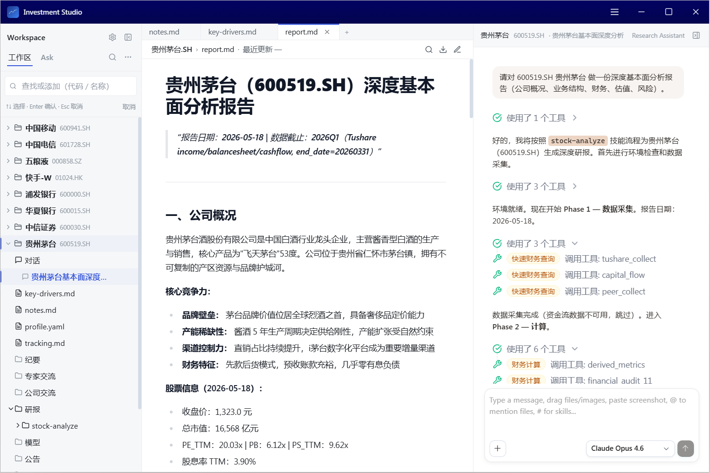

# OpenKosmos

**OpenKosmos** is a local-first AI Agent Studio that empowers you to create, configure, and run personalized AI agents tailored to your own workflows — with a low-code approach that puts productivity first.

It runs entirely on your desktop, provides native access to your local files and system, and connects to the broader AI ecosystem through MCP servers, skills, and multi-model support. Whether you're automating daily tasks, building research assistants, or orchestrating complex multi-step workflows, OpenKosmos gives you a flexible, privacy-respecting platform to get it done.



## ✨ Highlights

- 🏠 **Local-First** — Runs on your machine. Your data stays on your device.
- 🤖 **Personalized Agents** — Create custom agents with tailored instructions, tools, knowledge bases, and skills — no coding required.
- 🔌 **MCP Ecosystem** — Connect to any MCP server (stdio/SSE/HTTP) to extend agent capabilities with external tools and data sources.
- 🧩 **Skills & Context** — Package reusable AI prompt templates as skills; attach knowledge bases for domain-specific context.
- 🌐 **Multi-Model** — Switch between GitHub Copilot, OpenAI, Azure OpenAI, Google Gemini, Anthropic Claude, Cohere, and Ollama — all in one interface.
- 🔍 **Built-in Tools** — Web search (Bing/Google), web fetch, file operations, shell commands, Office document reading, and more — out of the box.
- 💾 **Long-Term Memory** — Semantic memory system powered by vector embeddings, so your agents remember what matters across sessions.
- 🖥️ **Cross-Platform** — Windows, macOS, and Linux support.

## Features

### 🤖 Personalized Agent Studio
- **Low-Code Agent Creation** — Configure agents through a visual editor: set system prompts, attach MCP servers, assign skills, and define knowledge bases — all without writing code.
- **Agent Library** — Browse, import, and share agent configurations from a built-in library.
- **Multi-Agent Workspace** — Run multiple agents in parallel chat sessions, each with its own context and tools.
- **Smart Context Compression** — Automatically compress long conversations to keep agents responsive without losing important context.

### 🔌 MCP (Model Context Protocol) Integration
- **Universal MCP Support** — Connect to any MCP server via stdio, SSE, or HTTP transport.
- **One-Click MCP Setup** — Add MCP servers from a curated library, or import directly from VSCode settings.
- **30+ Built-in Tools** — Web search, web fetch, file read/write/search, shell command execution, Office document parsing, and more — available to all agents by default.
- **Dynamic Tool Execution** — Agents autonomously discover and invoke tools during conversations, with user approval controls.

### 🧩 Skills & Knowledge Management
- **Skill Packages** — Portable prompt template archives (`.skill` / `.zip`) with metadata, installable from a library or local files.
- **Knowledge Bases** — Attach document folders to agents for retrieval-augmented generation (RAG) with domain-specific context.
- **Built-in Skills** — Pre-installed skills like `skill-creator` to help you build new skills from within the app.

### 🌐 Multi-Model AI Support
- **GitHub Copilot** — First-class integration with OAuth device flow authentication.
- **Multiple Providers** — OpenAI, Azure OpenAI, Google Gemini, Anthropic Claude, Cohere, and Ollama.
- **Model Switching** — Change models mid-conversation without losing context.
- **Streaming Responses** — Real-time token streaming with typewriter animation for a natural feel.

### 🏠 Local System Access
- **File Operations** — Read, write, create, search, and manage files on your local filesystem.
- **Shell Commands** — Execute terminal commands directly from agent conversations.
- **Workspace Integration** — Attach project folders with real-time file watching and fast ripgrep-powered search.
- **Screenshot Capture** — Multi-display screenshot with region selection, directly usable as chat input.

### 🧠 Long-Term Memory
- **Semantic Memory** — Vector-embedding-based memory powered by SQLite + sqlite-vec, stored locally.
- **Cross-Session Recall** — Agents remember important facts, preferences, and context across conversations.
- **Per-User Isolation** — Each user profile has its own memory store.
- **Optional Graph Memory** — Neo4j integration for knowledge graph-based reasoning (advanced).

### 🎨 Modern Desktop Experience
- **Glass Morphism UI** — Elegant dark theme with blur effects and smooth animations.
- **Multi-Tab Chat** — Work with multiple agents and conversations simultaneously.
- **Voice Input** — Speech-to-text powered by Whisper, running locally with GPU acceleration.
- **Auto-Update** — Seamless in-app updates via GitHub Releases or custom CDN.
- **Multi-Brand Support** — Customize app name, icons, and identity for white-label deployment.

## Getting Started

### Prerequisites

- **Node.js** 18.0.0 or later
- **Python** 3.10 or later (for some MCP servers)
- **GitHub Copilot** subscription (primary AI provider)

### Installation

1. **Clone the repository**
   ```bash
   git clone https://github.com/microsoft/open-kosmos.git
   cd open-kosmos
   ```

2. **Configure environment variables**
   ```bash
   # Windows
   copy .env.example .env.local
   
   # macOS/Linux
   cp .env.example .env.local
   ```

3. **Install dependencies**
   ```bash
   npm install
   ```

4. **Rebuild native modules for Electron**
   ```bash
   npx electron-rebuild
   ```

   > **Build tools required**: Windows needs [VS Build Tools](https://visualstudio.microsoft.com/visual-cpp-build-tools/), macOS needs `xcode-select --install`, Linux needs `sudo apt install build-essential`.

### Quick Start

```bash
# One-command development mode (recommended)
npm run dev:full

# Or start components separately
npm run dev          # Terminal 1: webpack-dev-server with HMR
npm run dev:main     # Terminal 2: Main process watch mode
npm run electron:dev # Terminal 3: Launch Electron
```

Production build:
```bash
npm run build && npm run electron
```

## Architecture

OpenKosmos is built on Electron with a clean multi-process architecture:

```
src/
├── main/                # Electron main process
│   └── lib/
│       ├── auth/        # GitHub Copilot OAuth authentication
│       ├── chat/        # Agent conversation engine
│       ├── mcpRuntime/  # MCP server lifecycle & built-in tools
│       ├── mem0/        # Long-term memory (vector + graph)
│       ├── featureFlags/# Feature flag system
│       ├── workspace/   # File tree & ripgrep search
│       └── userDataADO/ # Profile & data persistence
├── renderer/            # React 18 + TailwindCSS UI
│   ├── components/      # Chat, agents, settings, FRE
│   ├── atom/            # Custom atom-based state management
│   └── lib/             # Frontend utilities
├── shared/              # Type-safe IPC framework & constants
└── brands/              # Multi-brand configuration
```

**Key design principles:**
- **Type-safe IPC** — Renderer ↔ Main communication is fully typed at compile time.
- **Lazy initialization** — All heavy managers use lazy getters for fast startup.
- **Non-fatal errors** — Subsystem failures are logged, never crash the app.
- **Per-profile isolation** — Auth, data, memory, and skills are scoped per user.

For full architectural details, see [CLAUDE.md](./CLAUDE.md).

## Development

### Contributing

We welcome contributions! Please open an issue or submit a pull request on [GitHub](https://github.com/microsoft/open-kosmos).

### Workflow

```bash
git switch main && git pull
git checkout -b user/<your-alias>/<feature-name>
# Make changes, then submit PR
```

### Commands

```bash
# Development
npm run dev:full         # Full dev mode with HMR
npm run build            # Production build

# Testing & Quality
npm test                 # Jest unit tests
npm run test:e2e         # Playwright E2E tests
npm run lint             # Lint check
npm run lint:fix         # Auto-fix

# Distribution
npm run dist             # Build installer for current platform
npm run dist:win         # Windows (NSIS + ZIP)
npm run dist:mac         # macOS (DMG + ZIP)
npm run dist:linux       # Linux (AppImage)
```

## License

This project is licensed under the [MIT License](LICENSE).

## Contact

For questions, bug reports, or feature requests, please open an issue on [GitHub](https://github.com/microsoft/open-kosmos/issues).