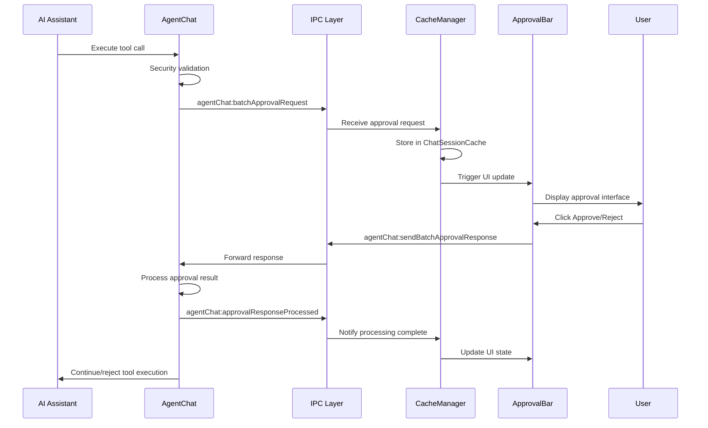

# Approval Request and Approval Bar System Design Document

## System Overview

The Approval Request and Approval Bar system is a security mechanism that requires explicit user authorization when the AI assistant executes tools that may access paths outside the workspace. The system implements a front-end/back-end separated architecture, supporting batch approval, timeout handling, and multi-session isolation.

## 1. System Architecture

### 1.1 Component Relationship Diagram
```
Backend AgentChat Instance → IPC Communication Layer → Frontend AgentChatSessionCacheManager → React Hooks → UI Components
```

### 1.2 Core Components
- **Backend**: [`AgentChat`](src/main/lib/chat/agentChat.ts) - Generation and processing of approval requests
- **IPC Layer**: [`main.ts`](src/main/main.ts) + [`preload.ts`](src/main/preload.ts) - Front-end/back-end communication bridge
- **State Management**: [`AgentChatSessionCacheManager`](src/renderer/lib/chat/agentChatSessionCacheManager.ts) - Frontend state management center
- **UI Component**: [`ApprovalBar`](src/renderer/components/chat/ApprovalBar.tsx) - User interface component

## 2. Trigger Mechanism

### 2.1 Tool Call Validation
When the AI assistant is about to execute tool calls, the system performs security validation:

1. **Batch Validation Entry Point**: [`agentChat.ts:1514`](src/main/lib/chat/agentChat.ts:1514)
   ```typescript
   const approvalMap = await this.batchValidateAndRequestApproval(response.tool_calls);
   ```

2. **Security Validation Logic**: [`agentChat.ts:2307`](src/main/lib/chat/agentChat.ts:2307)
   ```typescript
   const approvalRequests = SecurityValidator.extractApprovalRequests(batchResult);
   ```

### 2.2 Request Generation
- Generate a unique `requestId` for each tool requiring approval
- Batch process approval requests for multiple tools
- Generate batch ID: `batch_approval_${timestamp}_${random}`

## 3. Front-End/Back-End Communication Mechanism

### 3.1 IPC Event Definitions

#### Backend → Frontend: Batch Approval Request
**Event Name**: `agentChat:batchApprovalRequest`

**Data Structure**:
```typescript
{
  type: 'batch_tool_approval_request',
  batchRequestId: string,           // Batch unique identifier
  chatSessionId: string,           // Bound ChatSession ID
  requests: Array<{
    requestId: string,             // Individual request unique identifier
    toolCallId: string,            // Tool call ID
    toolName: string,              // Tool name
    paths: Array<{
      path: string,                // Access path
      normalizedPath?: string      // Normalized path
    }>,
    message: string                // Description message
  }>
}
```

**Sending Location**: [`agentChat.ts:2451`](src/main/lib/chat/agentChat.ts:2451)
```typescript
this.safeEmitEvent('agentChat:batchApprovalRequest', batchApprovalRequest);
```

#### Frontend → Backend: Approval Response
**Event Name**: `agentChat:sendBatchApprovalResponse`

**Data Structure**:
```typescript
{
  batchRequestId: string,          // Corresponding batch ID
  requestId: string,               // Corresponding request ID
  toolCallId: string,              // Corresponding tool call ID
  approved: boolean                // Approval result
}
```

**Handling Location**: [`main.ts:1662`](src/main/main.ts:1662)
```typescript
ipcMain.handle('agentChat:sendBatchApprovalResponse', async (event, response) => {
  // Find and call pending handler
  const handler = pendingApprovalHandlers.get(response.batchRequestId);
  if (handler) {
    handler(response);
  }
});
```

#### Backend → Frontend: Response Processing Completion Notification
**Event Name**: `agentChat:approvalResponseProcessed`

**Data Structure**:
```typescript
{
  chatSessionId: string,           // ChatSession ID
  requestId: string,               // Processed request ID
  toolCallId: string,              // Tool call ID
  approved: boolean                // Processing result
}
```

**Sending Location**: [`agentChat.ts:2483`](src/main/lib/chat/agentChat.ts:2483)
```typescript
this.eventSender.send('agentChat:approvalResponseProcessed', {
  chatSessionId: this.chatSessionId,
  requestId: response.requestId,
  toolCallId: response.toolCallId,
  approved: response.approved
});
```

### 3.2 Communication Lifecycle



## 4. ChatSession Binding Mechanism

### 4.1 Backend Binding
- Each `AgentChat` instance corresponds to a unique `chatSessionId`
- Approval requests are generated within the instance, naturally bound to a specific session
- Ensures complete isolation of approval requests between different sessions

### 4.2 Frontend State Management

#### ChatSessionCache Structure
```typescript
interface ChatSessionCache {
  chatSessionId: string;
  chatId: string;
  // ...other fields...
  pendingApprovalRequests?: Array<ApprovalRequestItem>;
}
```

#### Session Isolation Mechanism
[`agentChatSessionCacheManager.ts:1074-1082`](src/renderer/lib/chat/agentChatSessionCacheManager.ts:1074-1082)
```typescript
// Key session isolation logic
if (chatSessionId === this.currentChatSessionId) {
  // Current active session: immediately trigger UI update
  this.notifyCurrentChatSessionIdCallbacks();
} else {
  // Non-active session: cache only, render when switched to
  console.log('📦 Non-current session - cached for later rendering');
}
```

## 5. React State Integration

### 5.1 Dedicated Hook
[`agentChatSessionCacheManager.ts:1568-1602`](src/renderer/lib/chat/agentChatSessionCacheManager.ts:1568-1602)
```typescript
export function usePendingApprovalRequests(): Array<ApprovalRequestItem> {
  const currentSessionId = useCurrentChatSessionId();
  const [requests, setRequests] = useState<any[]>([]);
  
  useEffect(() => {
    if (!currentSessionId) {
      setRequests([]);
      return;
    }
    
    // Get current session's requests
    const cache = manager.getChatSessionCache(currentSessionId);
    setRequests(cache?.pendingApprovalRequests || []);
    
    // Subscribe to changes
    const unsubscribe = manager.subscribeToCurrentChatSessionId(() => {
      const updatedCache = manager.getChatSessionCache(currentSessionId);
      setRequests(updatedCache?.pendingApprovalRequests || []);
    });
    
    return unsubscribe;
  }, [currentSessionId]);
  
  return requests;
}
```

### 5.2 Component Usage
[`ChatView.tsx:190`](src/renderer/components/chat/ChatView.tsx:190)
```typescript
const batchApprovalRequests = usePendingApprovalRequests();
```

## 6. UI Component Design

### 6.1 ApprovalBar Features
- **Batch Display**: Simultaneously shows approval requests for multiple tools
- **60-second Countdown**: [`ApprovalBar.tsx:34`](src/renderer/components/chat/ApprovalBar.tsx:34) Automatic timeout mechanism
- **Path Display**: Supports direct display for single paths, collapsible display for multiple paths
- **Independent Operations**: Separate Approve/Reject buttons for each request

### 6.2 Integration Method
[`ChatInput.tsx:1110-1118`](src/renderer/components/chat/ChatInput.tsx:1110-1118)
```typescript
{/* ApprovalBar embedded directly above the input-area */}
{approvalRequests.length > 0 && onApproveRequest && onRejectRequest && (
  <ApprovalBar
    requests={approvalRequests}
    onApprove={onApproveRequest}
    onReject={onRejectRequest}
    onTimeoutAutoReject={onTimeoutAutoReject}
  />
)}
```

## 7. User Response Handling

### 7.1 Approve/Reject Flow
[`ChatView.tsx:802-831`](src/renderer/components/chat/ChatView.tsx:802-831)
```typescript
const handleApprove = useCallback(async (requestId: string) => {
  const request = batchApprovalRequests.find(r => r.requestId === requestId);
  if (!request) return;

  try {
    // Send approval response to main process
    await window.electronAPI.agentChat.sendBatchApprovalResponse({
      batchRequestId,
      requestId: request.requestId,
      toolCallId: request.toolCallId,
      approved: true,
    });
  } catch (error) {
    console.error('Failed to approve request:', error);
  }
}, [batchRequestId, batchApprovalRequests]);
```

### 7.2 Timeout Handling Mechanism
[`ApprovalBar.tsx:50-59`](src/renderer/components/chat/ApprovalBar.tsx:50-59)
```typescript
useEffect(() => {
  const timer = setInterval(() => {
    setCountdown((prev) => {
      if (prev <= 1) {
        clearInterval(timer);
        // Countdown ended: batch send rejection responses
        if (onTimeoutAutoReject && currentRequestIds.length > 0) {
          onTimeoutAutoReject(currentRequestIds);
        }
        return 0;
      }
      return prev - 1;
    });
  }, 1000);
  
  return () => clearInterval(timer);
}, [requests.length, onTimeoutAutoReject]);
```

## 8. Session Switching Handling

### 8.1 Automatic Adaptation
- `useCurrentChatSessionId()` Hook automatically tracks the current active session
- `usePendingApprovalRequests()` Hook automatically subscribes to the new session's state
- Achieves seamless session switching experience

### 8.2 State Persistence
- Each session's approval state is independently cached in `ChatSessionCache`
- Supports users working in parallel across multiple sessions
- Approval state is correctly restored when switching back to a previous session

## 9. Key Design Features

### 9.1 Security Features
- **Default Deny**: Both timeout and explicit rejection block tool execution
- **Path Validation**: Only access to paths outside the workspace requires approval
- **Batch Processing**: A single request can include multiple paths for multiple tools

### 9.2 User Experience
- **Intuitive Interface**: Clearly displays tool name, access paths, and countdown
- **Real-time Updates**: Status automatically syncs without requiring a refresh
- **Session Isolation**: Correct state management in multi-Agent/Session environments

### 9.3 Performance Optimization
- **Smart Rendering**: Only approval requests for the current session trigger UI updates
- **Caching Mechanism**: Non-active session requests are cached to avoid unnecessary rendering
- **Responsive Design**: Efficient state management based on React Hooks

## 10. Data Flow Summary

The entire system's data flow can be summarized as:

```
Tool Execution Request → Security Validation → Generate Approval Request → 
IPC Communication (with chatSessionId) → Frontend Caches by Session → 
React Hook Subscribes → UI Component Renders → User Action → 
Response Sent Back → Backend Processing → State Cleanup Notification
```

This design ensures that the approval system operates correctly, securely, and efficiently in complex multi-Agent, multi-Session environments, providing users with a clear authorization control interface.